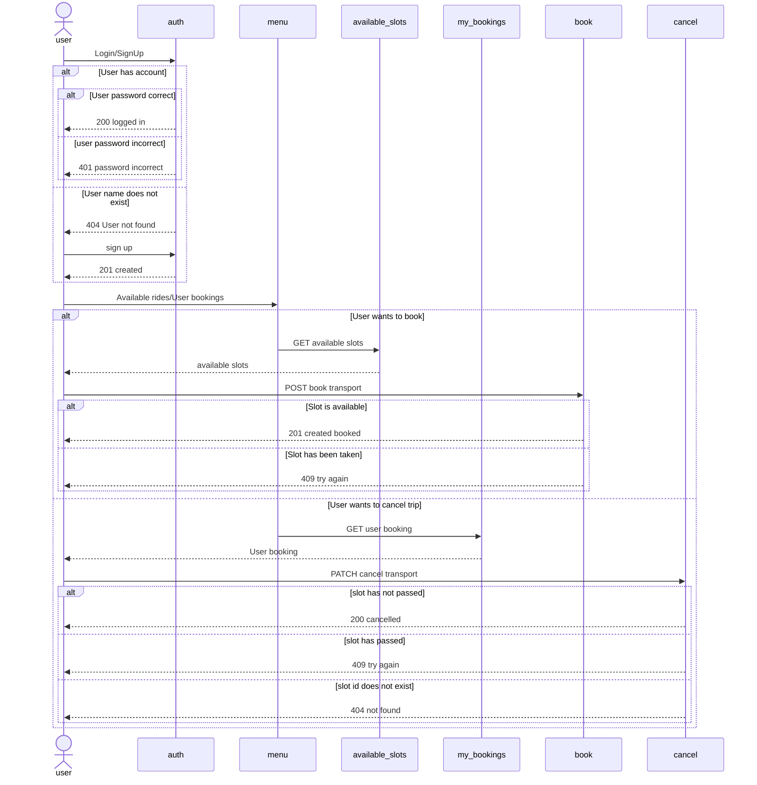
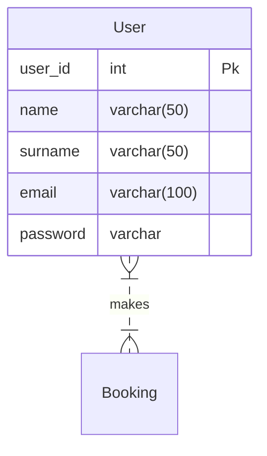

# Online Reservation System

```mermaid
    sequenceDiagram
        actor U as user
        participant A as auth
        participant  M as menu
        participant AV as available_slots
        participant MB as my_bookings
        participant B as book
        participant C as cancel
        
        U->>A: Login/SignUp
        alt User has account
            alt User password correct
            A-->>U: 200 logged in
            else user password incorrect
            A-->>U: 401 password incorrect
            end
        else User name does not exist
            A -->>U: 404 User not found
            U->>A: sign up 
           A-->>U: 201 created 
        end
        U->>M: Available rides/User bookings
         alt User wants to book
               M->>AV: GET available slots
               AV-->>U: available slots
                U->>B: POST book transport
             alt Slot is available  
                    B-->>U: 201 created booked 
                else Slot has been taken
                    B-->> U: 409 try again
                end
           else User wants to cancel trip
                M->>MB: GET user booking
                MB-->>U: User booking
                U->>C: PATCH cancel transport
                alt  slot has not passed   
                    C-->>U: 200 cancelled
                else slot has passed 
                    C-->> U: 409 try again
                else slot id does not exist
                    C -->> U: 404 not found 
                end
       end 
```

```mermaid
   erDiagram
       User }|..|{ Booking : makes
       
       User{
           user_id int Pk
           name varchar(50)
           surname varchar(50)
           email varchar(100)
           password varchar
           
       }

```